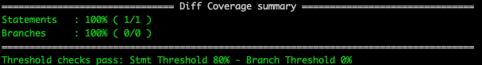
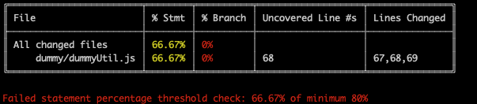

# Coverage On Diff

A tool that uses an [instanbul](https://istanbul.js.org/docs/advanced/alternative-reporters/) json code coverage report and git diff to calculate the code coverage on new lines added


## Installation:
```shell
npm i coverage-on-diff --save-dev
```

## Usage:
```shell
terminal > ./coverageOnDiff --help
Run diff against current code coverage
Usage: cli.js -d [file]

Options:
  --version       Show version number                                  [boolean]
  --diff, -d      diff file to compare code coverage to           [string] [required]
  --coverage, -c  instanbul json code coverage report to use against diff
                            [string] [default: "./coverage/coverage-final.json"]
  --path, -p      relative root dir for code coverage
                      [string] [default: "./"]
  --report, -r    type of report
             [array] [choices: "text", "text-summary"] [default: "text-summary"]
  --stmt, -s      percentage threshold for stmt coverage  [number] [default: 80]
  --branch, -b    percentage threshold for branch coverage [number] [default: 0]
  --ignore, -i    ignore threshold checks                              [boolean]
  --help          Show help                                            [boolean]
```

## Reports
The final report will look similar to below:

_text-summary view_
```shell
./coverageOnDiff -d ~/dev/branch.diff
```



_text view_
```shell
./coverageOnDiff -d ~/dev/branch.diff -r text
```



Threshold test will run by default with 80% statement coverage and 0% branch coverage 
